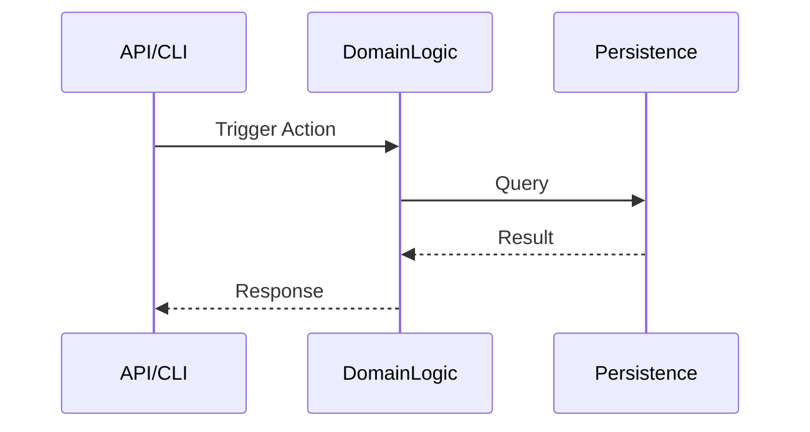

# Command: Trace (v16.2 Code Explorer)
- **Usage**: `/project-trace "$ARGUMENTS"`
- **Agent**: Code Explorer

## 🕵️‍♂️ Phase 0: The Thinking Process (Mandatory)
> **INSTRUCTION**: Output a `<thinking>` block before using any tools.
1.  **Strategy**: Am I tracing a Data Flow (Model -> DB) or Control Flow (API -> Service)?
2.  **Boundaries**: Define the stop condition (e.g., "Stop at Database Layer").

## 🧠 Phase 1: Feature Discovery
1.  **Entry Point**: Use `grep` or `find` to locate the trigger (API route, CLI arg, UI Event).
    - *Tool*: `grep -r "$ARGUMENTS" src/`
2.  **Map Files**: List the core files involved. Don't read everything yet.

## 🔗 Phase 1.5: Call Graph Analysis (Auto-Trace)
1.  **Auto-Trace**: Run `python3 ~/.claude/skills/pactkit-visualize/scripts/visualize.py visualize --mode call --entry <function_name>`.
    - *Result*: BFS transitive closure from entry function → `call_graph.mmd`.
2.  **Read Graph**: Read `docs/architecture/graphs/call_graph.mmd` to see all reachable functions.
3.  **Scope**: Use this to narrow down Phase 2 tracing targets.

## 🧵 Phase 2: Deep Tracing (The Thread)
1.  **Follow the Call**:
    - If `main()` calls `init_app()`, read `init_app`.
    - If `service.login()` is called, grep for `def login` to find the definition.
2.  **Data Spy**: Note how data structures change (e.g., `dict` -> `UserObj` -> `JSON`).

## 🏗️ Phase 3: Visual Synthesis (MANDATORY)
You must output a **Mermaid Sequence Diagram** to visualize the flow.

## 📝 Phase 4: Archaeologist Report
- **Patterns**: Identify Design Patterns used.
- **Debt**: Flag hardcoded values, complex logic, or lack of tests.
- **Key Files**: List the top 3 files critical to this feature.
